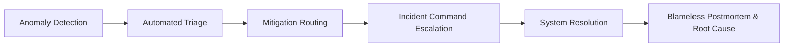

# 🚀 Site Reliability Engineering (SRE) Master Roadmap

[](https://opensource.org/licenses/MIT)
[](http://makeapullrequest.com)

This roadmap is a production-grade guide for engineers aiming to become elite **Site Reliability Engineers** capable of designing, operating, automating, scaling, and securing modern distributed systems. 

Site Reliability Engineering is not merely a tool checklist; it is a comprehensive engineering discipline bridging software engineering and systems administration to ensure cloud-native reliability at scale.

> [!IMPORTANT]
> **Core Philosophy:** Master fundamentals over temporary tools. The underlying principles of Linux kernels, TCP/IP networking, and distributed systems architecture outlast any single product. Treat tools as tactical implementations for operational problems.

---

## 📖 Table of Contents

1. [What is SRE?](#1-what-is-sre)
   - [Core Responsibilities](#core-responsibilities-of-an-sre)
   - [SRE vs. DevOps vs. Platform Engineering](#sre-vs-devops-vs-platform-engineering)
2. [SRE Roles & Career Progression](#2-sre-roles--career-progression)
3. [The Complete 11-Phase SRE Learning Roadmap](#3-the-complete-11-phase-sre-learning-roadmap)
   - [Phase 1: Operating Systems & Linux Mastery](#phase-1-operating-systems--linux-mastery)
   - [Phase 2: Programming & Automation Tooling](#phase-2-programming--automation-tooling)
   - [Phase 3: Cloud Platforms & Infrastructure as Code (IaC)](#phase-3-cloud-platforms--infrastructure-as-code-iac)
   - [Phase 4: Containers & Kubernetes Mastery](#phase-4-containers--kubernetes-mastery)
   - [Phase 5: Automated CI/CD Pipelines & GitOps Delivery](#phase-5-automated-cicd-pipelines--gitops-delivery)
   - [Phase 6: Observability Engineering](#phase-6-observability-engineering)
   - [Phase 7: Reliability Engineering & Incident Management](#phase-7-reliability-engineering--incident-management)
   - [Phase 8: DevSecOps & Zero Trust Architecture](#phase-8-devsecops--zero-trust-architecture)
   - [Phase 9: Platform Engineering & IDPs](#phase-9-platform-engineering--idps)
   - [Phase 10: FinOps & Cloud Cost Engineering](#phase-10-finops--cloud-cost-engineering)
   - [Phase 11: AI/LLM Infrastructure Reliability](#phase-11-aillm-infrastructure-reliability)
4. [Core SRE Philosophies, Signals & Methodologies](#4-core-sre-philosophies-signals--methodologies)
5. [Enterprise Architecture & Reliability Patterns](#5-enterprise-architecture--reliability-patterns)
6. [SRE Production Readiness Checklist](#6-sre-production-readiness-checklist)
7. [Chaos Engineering & GameDays](#7-chaos-engineering--gamedays)
8. [Project-Based Learning Paths](#8-project-based-learning-paths)
9. [High-Impact Enterprise Portfolio Architectures](#9-high-impact-enterprise-portfolio-architectures)
10. [Essential Tools Matrix & Recommended Stack](#10-essential-tools-matrix--recommended-stack)
11. [Interview Preparation & Strategic Plans](#11-interview-preparation--strategic-plans)

---

## 1. What is SRE?

Originally pioneered by Google, **Site Reliability Engineering** applies software engineering mindsets to operational and infrastructure bottlenecks. An SRE treats operational tasks as dynamic software engineering challenges, proactively building automated self-healing mechanisms.

### Core Responsibilities of an SRE

| Capability Area | Core Operational Focus |
| :--- | :--- |
| **Reliability** | Guaranteeing aggressive availability metrics, fault isolation, and cross-region resiliency. |
| **Scalability** | Architecting stateless/stateful systems capable of massive horizontal expansion. |
| **Automation** | Systematically targeting and eliminating manual, repetitive operational toil. |
| **Observability** | Establishing proactive metrics, distributed tracing, and centralized log telemetry. |
| **Incident Response** | Orchestrating incident command workflows, mitigation routing, and blameless postmortems. |
| **Capacity Planning** | Formulating mathematical baseline models for targeted load and usage forecasting. |
| **Performance** | Tuning kernel-level configurations to minimize latency and maximize global throughput. |
| **Security Hardening** | Enforcing runtime security overlays, automated certificate lifecycles, and policy-as-code. |
| **Cost Optimization** | Enforcing architectural FinOps boundaries to streamline compute and network investments. |

### SRE vs. DevOps vs. Platform Engineering

| Discipline | Core Mission Focus | Primary Output Signal |
| :--- | :--- | :--- |
| **DevOps** | Organizational philosophy promoting rapid collaboration and pipeline integration. | Streamlined continuous deployment cadences. |
| **SRE** | Data-driven reliability enforcement utilizing strict SLIs, SLOs, and Error Budgets. | Resilient, highly available production clusters. |
| **Platform Engineering** | Scaffolding secure Internal Developer Platforms (IDPs) and standardized golden paths. | Abstracted self-service developer infrastructure. |

---

## 2. SRE Roles & Career Progression

| Level | Targeted Roles | Core Technical Expectation |
| :--- | :--- | :--- |
| **Entry Level** | Junior SRE, NOC Engineer, Cloud Support Analyst | Fundamental Linux commands, log inspection, basic CI/CD execution, alert verification. |
| **Mid Level** | Site Reliability Engineer, Platform Engineer, K8s Administrator | Multi-cluster orchestration, infrastructure automation, proactive dashboard design, incident handling. |
| **Senior Level** | Senior SRE, Staff Systems Engineer, Principal Platform Architect | Enterprise cloud landing zones, cross-region failover protocols, organizational error budgets, internal tools. |

---

## 3. The Complete 11-Phase SRE Learning Roadmap

```
Linux Internals → Advanced Networking → Python/Go Automation → Multi-Cloud Architecture
→ Enterprise K8s Control Planes → Complete Observability → Automated Reliability/SLOs
→ DevSecOps Runtime Overlays → Enterprise IDPs → FinOps Models → AI/LLM InfraOps
```

### Phase 1: Operating Systems & Linux Mastery

| Domain Area | Advanced Concepts & Subsystems | Essential Shell Utilities |
| :--- | :--- | :--- |
| **Kernel & Filesystems** | VFS layers, inodes, file descriptors, journaled filesystems (ext4/xfs), POSIX ACLs. | `lsof`, `strace`, `df`, `du`, `stat` |
| **Process Management** | Process states, task scheduling, signals, daemon lifecycles, `systemd` targets. | `ps`, `top`, `htop`, `kill`, `pkill`, `systemctl` |
| **Resource Isolation** | Namespaces (pid, net, mnt), cgroups v2 resource capping, kernel memory profiling. | `unshare`, `nsenter`, `cgcreate`, `free` |
| **Network Subsystem** | TCP/IP connection handshakes, socket queues, packet filtering frameworks (`iptables`/`nftables`). | `ss`, `netstat`, `ip`, `tcpdump`, `traceroute` |
| **Deep Troubleshooting** | NUMA architecture tuning, Linux HugePages optimizations, eBPF dynamic tracking tracing. | `vmstat`, `iostat`, `dmesg`, `journalctl` |

### Phase 2: Programming & Automation Tooling

| Preferred Language | Primary Engineering Use Cases | Key Distributed Patterns |
| :--- | :--- | :--- |
| **Python** | Proactive automation pipelines, API scripting, custom Slack/Teams bots, data parsing. | Async/Await concurrency, error retries, backoff. |
| **Go (Golang)** | High-performance custom Kubernetes Operators, CLI tooling, eBPF probes, custom webhooks. | Channels, Goroutines, robust standard HTTP servers. |
| **Bash** | System initialization hooks, entrypoint scripts, ephemeral setup configurations. | POSIX compatibility, input validation arrays. |

### Phase 3: Cloud Platforms & Infrastructure as Code (IaC)

| Core Focus Area | Foundational Best Practices | Recommended Enterprise Stack |
| :--- | :--- | :--- |
| **Cloud Landing Zones** | Immutable VPC/VNet modular structures, private NAT Gateways, transit routing. | **AWS**, **Azure**, **Google Cloud Platform (GCP)** |
| **Declarative Provisioning** | Remote state locking, multi-environment modular design, systematic drift tracking. | **Terraform**, **OpenTofu**, **Pulumi**, **Azure Bicep** |
| **Configuration Orchestration** | Playbook structure modularity, dynamic inventory routing, secret parameter injection. | **Ansible**, **Packer** |

### Phase 4: Containers & Kubernetes Mastery

| Architecture Domain | Core Orchestration Subsystems | Industry Leading Tooling |
| :--- | :--- | :--- |
| **Container Runtimes** | Secure OCI standards, rootless/distroless execution, multi-stage minimal builds. | **Docker**, `containerd`, `podman`, `buildkit` |
| **Workloads & Controllers** | Base Pod configuration targets, StatefulSets for persistent persistence, dynamic scaling. | **Kubernetes (EKS / AKS / GKE)** |
| **Advanced Networking** | Dynamic Ingress routing, modern Gateway API structures, CNI overlays. | **Cilium (eBPF)**, **Calico** |
| **Service Mesh Interconnect** | Automated mTLS injection, circuit breaking, dynamic canary routing paths. | **Istio**, **Linkerd** |
| **Persistent Storage** | Container Storage Interface (CSI) integrations, dynamic volume snapshots. | Cloud-native Block/File providers |

### Phase 5: Automated CI/CD Pipelines & GitOps Delivery

| Delivery Methodology | Structural Best Practices | Key Ecosystem Platforms |
| :--- | :--- | :--- |
| **Continuous Integration** | Automated test layers, container image vulnerability scanning, signed SBOM outputs. | **GitHub Actions**, **GitLab CI**, **Jenkins** |
| **Declarative GitOps** | Reconciling declarative states instantly, cluster multi-tenancy access control. | **Argo CD**, **Flux CD** |
| **Progressive Rollouts** | Canary releases with baseline analysis, blue/green dynamic cluster switching. | **Argo Rollouts**, **Flagger** |

### Phase 6: Observability Engineering

| Telemetry Pillar | Core Operational Intent | Target Infrastructure Platforms |
| :--- | :--- | :--- |
| **Metrics Collection** | Time-series quantitative scraping, resource exhaustion triggers, proactive alarms. | **Prometheus**, **Thanos**, **Cortex** |
| **Log Aggregation** | Event stream correlation, structured parsing, efficient remote stream queries. | **Grafana Loki**, **Elasticsearch (ELK)**, **Fluent Bit** |
| **Distributed Tracing** | End-to-end multi-service tracking, latency bottleneck localization, dependency mapping. | **OpenTelemetry (OTel)**, **Grafana Tempo**, **Jaeger** |
| **Visualization Layers** | Dynamic dashboard scaffolding covering RED/USE operational frameworks. | **Grafana** |

### Phase 7: Reliability Engineering & Incident Management



* **Service Level Indicators (SLIs)**: Carefully selected quantitative metrics measuring service efficiency.
* **Service Level Objectives (SLOs)**: Targeted numerical reliability benchmarks negotiated with stakeholders.
* **Error Budgets**: The mathematical margin allowed for unreliability before continuous delivery pipelines are blocked to prioritize platform stability.
  $$\text{Downtime Budget} = \text{Total Window Time} \times (1 - \text{Target SLO})$$

### Phase 8: DevSecOps & Zero Trust Architecture

| Defense Layer | Security Implementation Target | Leading Security Platforms |
| :--- | :--- | :--- |
| **Static Analysis & Scanning** | Continuous container vulnerability verification and static artifact assessments. | **Trivy**, **Grype**, **Checkov** |
| **Runtime Intrusion** | Kernel-level eBPF monitoring capturing unauthorized processes or network connections. | **Falco**, **Tetragon** |
| **Policy as Code Enforcement** | Validating object structures dynamically inside K8s admission controllers. | **Kyverno**, **Open Policy Agent (OPA)** |
| **Dynamic Secrets Engine** | Centralized, short-lived ephemeral cryptographic credential management. | **HashiCorp Vault**, **External Secrets Operator** |

### Phase 9: Platform Engineering & IDPs

> [!TIP]
> Internal Developer Platforms (IDPs) abstract Kubernetes resource complexity from product developers. Building structured self-service scaffolds significantly reduces platform support toil.

* **Developer Portals**: Integrating platform services, API specs, and runbooks via **Spotify Backstage**.
* **Cloud-Native Provisioning**: Managing raw AWS/Azure cloud elements dynamically using **Crossplane** operators.

### Phase 10: FinOps & Cloud Cost Engineering

| Optimization Protocol | Targeted Resource Savings Mechanism | Visibility Tooling |
| :--- | :--- | :--- |
| **Unit Allocation** | Strict Kubernetes namespace resource requests/limits budgeting. | **Kubecost**, **OpenCost** |
| **CI/CD Impact Audits** | Predicting exact financial line-item cost increases inside infrastructure PR diffs. | **Infracost** |
| **Autonomous Scaling** | Event-driven scaling utilizing queue queues and connection loads. | **KEDA (Kubernetes Event-driven Autoscaling)** |

### Phase 11: AI/LLM Infrastructure Reliability

As artificial intelligence workloads transition into core production targets, SREs oversee performance metrics, GPU scheduling, and hardware utilization.

| Area Focus | SRE Operational Expectation | Core Technology Solutions |
| :--- | :--- | :--- |
| **GPU Orchestration** | Slicing and dynamic scheduling of enterprise NVIDIA/AMD cluster architectures. | Kubernetes Device Plugins, **Run:ai**, **NVIDIA GPU Operator** |
| **Vector DB Management** | Scaling resilient distributed multi-shard Vector indexing stores. | **Milvus**, **Weaviate**, **Qdrant** |
| **LLM Telemetry** | Tracking API latency profiles, prompt/token efficiency limits, and hallucinations. | **LangSmith**, **Arize AI**, **Helicone** |
| **AIOps Automation** | Utilizing fine-tuned models to correlate alerts, draft mitigation plans, and summarize outages. | LLM Vector Search Integrations |

---

## 4. Core SRE Philosophies, Signals & Methodologies

### The Four Golden Signals
1. **Latency**: The duration required to service a given request successfully or unsuccessfully.
2. **Traffic**: The volume of total demand placed on the targeted platform systems.
3. **Errors**: The immediate percentage rate of failed request transactions.
4. **Saturation**: The total measure of active capacity limits and resource queue exhaustion.

### RED vs. USE Telemetry Frameworks

#### RED Method (Targeted at Microservice APIs)
* **Rate**: Request transactions per second.
* **Errors**: Total percentage of failed transactions.
* **Duration**: Direct distribution of execution times.

#### USE Method (Targeted at Underlying Infrastructure)
* **Utilization**: Average active processing duration consumed by resources.
* **Saturation**: Backlogged operation execution requests waiting in queues.
* **Errors**: Total unhandled hardware/kernel interface failures.

---

## 5. Enterprise Architecture & Reliability Patterns

### High-Fidelity Kubernetes Traffic Blueprint
```
[External Users] 
       │
       ▼
[Global Edge CDN / Cloudflare WAF]
       │
       ▼
[Cloud Layer 4/7 Load Balancer]
       │
       ▼
[Ingress Controller / Gateway API]
       │
       ▼
[Service Mesh Sidecar Proxy (mTLS)]
       │
       ▼
[Target Application Pod Containers] ──► [Distributed Databases / Message Queues]
```

### Core Resiliency Patterns

| Architectural Pattern | Primary Engineering Mechanism |
| :--- | :--- |
| **Circuit Breaker** | Automatically blocking downstream calls to failing dependencies to prevent total cluster lockup. |
| **Bulkhead Isolation** | Partitioning process resource memory pools to prevent localized failures from expanding globally. |
| **Exponential Backoff** | Gradually increasing intervals between failed re-connection retries to prevent retry storms. |
| **Graceful Degradation** | Disabling non-essential modules during intense peak traffic events to prioritize primary core flows. |

---

## 6. SRE Production Readiness Checklist

### 🏗️ Infrastructure & Scalability
- [ ] Multi-Availability Zone deployment active for core stateful elements.
- [ ] Automated validation testing runs against raw backup image files regularly.
- [ ] Entire environment defined absolutely via version-controlled IaC codebases.

### 🛡️ Hardened Security
- [ ] Strict Least-Privilege RBAC controls enforced across service accounts.
- [ ] TLS termination enabled globally with auto-rotation policies integrated.
- [ ] Admission controllers explicitly block deployment of un-scanned container bases.

### 📊 Comprehensive Telemetry
- [ ] Custom instrumentation maps golden signals directly to operational dashboards.
- [ ] Alerting routes directly to automated pagers targeting on-call schedules cleanly.
- [ ] Distributed tracing Context Propagation headers injected across API endpoints.

---

## 7. Chaos Engineering & GameDays

Proactively injecting controlled failure validates self-healing orchestration scripts under simulated stress.

| Targeted Chaos Vector | Intent / SRE Validation Goal | Recommended Orchestration Framework |
| :--- | :--- | :--- |
| **Random Pod Deletion** | Ensuring stateless deployment availability remains unimpeded during automated evictions. | **LitmusChaos**, **Chaos Mesh** |
| **Network Blackholing** | Confirming API client libraries leverage appropriate timeouts and backoff routines. | **Gremlin**, **AWS FIS** |
| **Kernel Exhaustion** | Validating node autoscalers gracefully shift workloads to newly initialized nodes. | **Steadybit** |

---

## 8. Project-Based Learning Paths

### 🟢 Beginner Capstone Projects
1. **Automated Linux Baseline Reporter**: Build a comprehensive Python script that formats system performance baselines and posts formatted summary alerts directly into dedicated Slack channels.
2. **Dockerized Reverse Proxy Topology**: Initialize robust NGINX configurations containerized via Docker incorporating automatic TLS generation, health evaluations, and connection constraints.
3. **CI/CD Vulnerability Gate**: Construct an automated GitHub Actions flow that halts integration phases immediately if security vulnerabilities are identified inside container layers.

### 🟡 Intermediate Capstone Projects
1. **Multi-Service Telemetry Pipeline**: Deploy targeted containerized microservices integrating native OpenTelemetry libraries to publish metric layers and trace pipelines directly to centralized Grafana backends.
2. **Autonomous Self-Healing Loop**: Write custom Python scripts triggered by Prometheus Webhook events that dynamically execute target verification procedures and restore disrupted state elements.
3. **Strict Error Budget Alarm**: Draft production-grade SLO definitions within Prometheus that monitor active burn rates and alert platform engineers long before absolute depletion thresholds are breached.

### 🔴 Advanced Enterprise Portfolio Blueprints
1. **Unified Developer Capability Portal**: Integrate an enterprise instance of Backstage mapping dynamic API definitions, service tracking scorecards, and single-click ephemeral testing environments.
2. **Resilient Stateful Database Architecture**: Scold highly available multi-master database clusters inside Kubernetes validated by continuous network chaos testing protocols measuring absolute zero-loss recovery parameters.

---

## 9. High-Impact Enterprise Portfolio Architectures

To secure senior-level platform positions, portfolios must match the strict hierarchy, testing rigor, and documentation layouts seen inside top-tier tech organizations.

### Blueprint A: Enterprise Multi-Cluster Control Plane
A layout designed to demonstrate expertise in multi-cloud governance, advanced fleet scaling, and enterprise GitOps validation paths.

```plaintext
enterprise-sre-platform/
├── .github/workflows/
│   ├── infrastructure-plan.yml
│   ├── infrastructure-apply.yml
│   ├── container-security-scan.yml
│   └── continuous-chaos-validation.yml
├── idp-platform/
│   ├── backstage/
│   │   ├── app-config.production.yaml
│   │   └── templates/
│   └── developer-portal/
├── platform-engineering/
│   ├── paved-roads/
│   │   ├── observability-baseline/
│   │   └── network-security-baseline/
│   └── reusable-modules/
│       └── terraform/
├── multi-cluster-fleet/
│   ├── global-ingress/
│   ├── cluster-api-bootstrap/
│   └── service-mesh-federation/
├── aiops-auto-remediation/
│   ├── anomaly-detection-rules/
│   └── remediation-engine/
└── reference-architectures/
    ├── enterprise-aks-blueprint/
    └── secure-multi-region-failover/
```

### Blueprint B: Targeted Reliability Monorepo Lab
A focused portfolio layout demonstrating technical capability in running localized chaos routines, continuous load verifications, and professional blameless postmortem reports.

```plaintext
sre-reliability-lab/
├── docs/
│   ├── architecture-decision-records/
│   ├── blameless-postmortems/
│   └── negotiated-slos/
├── platform-infrastructure/
│   ├── terraform-landing-zones/
│   └── base-k8s-manifests/
├── telemetry-config/
│   ├── prometheus-recording-rules/
│   └── grafana-provisioned-dashboards/
├── load-testing-engine/
│   └── k6-traffic-simulations/
└── continuous-chaos/
    └── litmus-experiments/
```

> [!NOTE]
> **Why recruiters prioritize these structures:** Hiring managers look for clean structure separation, rigorous automated pipelines inside `.github/`, and concrete real-world evidence of postmortems and system load evaluations.

---

## 10. Essential Tools Matrix & Recommended Stack

| Target Engineering Capability | Standard Industry Stack | Emerging Next-Gen Stack (2026) |
| :--- | :--- | :--- |
| **Provisioning Infrastructure** | HashiCorp Terraform, AWS CloudFormation | OpenTofu, Crossplane Providers |
| **GitOps Reconcilers** | Argo CD, Flux CD | Argo CD Multi-Cluster Fleet |
| **Platform Orchestration** | Kubernetes, Docker Engine | eBPF-powered Kubernetes (Cilium) |
| **Observability Telemetry** | Prometheus, Grafana, ELK Suite | Grafana Loki, Tempo, OpenTelemetry |
| **Security Validation** | HashiCorp Vault, Trivy | Falco, Tetragon, OPA Gatekeeper |
| **Cost Enforcement** | AWS Cost Explorer, Azure Budgets | Kubecost, Infracost Automation |
| **Developer Capability** | Confluence Wiki Pages | Backstage Software Catalog Systems |

---

## 11. Interview Preparation & Strategic Plans

### Scenario-Based SRE Interview Matrix

| Given Production Outage Scenario | Primary Investigation Action | Targeted Remediation Protocol |
| :--- | :--- | :--- |
| **Sudden Global API Server Latency** | Inspect memory saturation, check DNS upstream processing delays. | Implement request rate limiting, horizontally scale proxy target instances. |
| **Intense Stateful Database Load** | Check query plans via telemetry traces, inspect unhandled locking deadlocks. | Promote standby instances, optimize slow indexes, enforce thread limits. |
| **Unplanned Network Partition** | Audit cluster node state statuses, inspect overlay network router parameters. | Enforce exponential connection retries, isolate failed local node nodes. |

### Targeted Engineering Certification Paths
* **Certified Kubernetes Administrator (CKA)** & **Certified Kubernetes Security Specialist (CKS)**
* **AWS Certified DevOps Engineer Professional** / **Azure DevOps Solutions Expert**
* **HashiCorp Certified Terraform Associate**

### Strategic 1-Year Master Career Execution Plan
* **Quarter 1**: Master deep Linux systems tuning, standard POSIX commands, and write highly resilient asynchronous Python automation libraries.
* **Quarter 2**: Deep-dive into distributed Kubernetes orchestration layers, declarative GitOps deployments, and structured custom metrics collection.
* **Quarter 3**: Build comprehensive enterprise telemetry systems mapping end-to-end trace loops, integrate automated dynamic security overlays.
* **Quarter 4**: Design fully integrated Internal Developer Platforms utilizing Backstage blueprints, integrate rigorous AI infrastructure monitoring.

---

## 🤝 Contributing & Community Standards
Contributions expanding real-world edge scenarios, new architectural blueprints, or specialized capability tables are encouraged. Please submit an issue detailed with proposed updates prior to submitting explicit code PRs.

## ⚖️ License
Distributed cleanly under the provisions of the standard **MIT License**.
